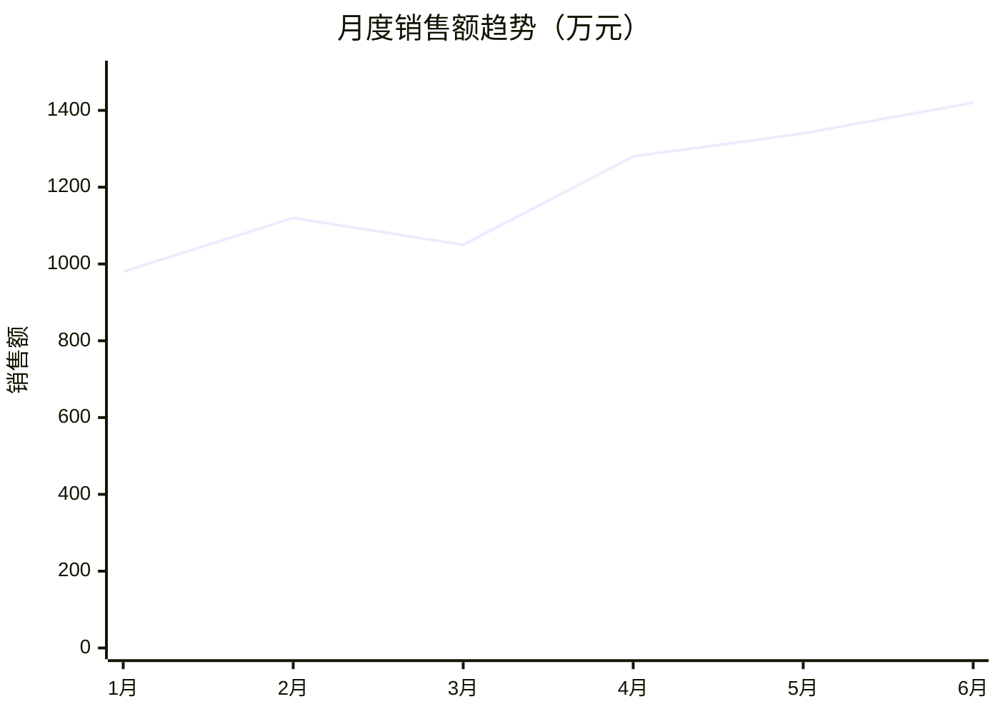
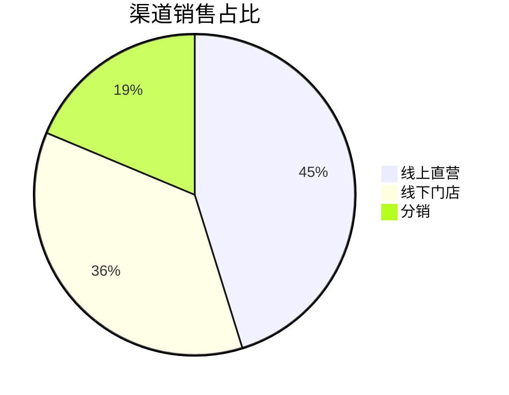

# 三通道图表规范（chart-spec）

数据洞察报告的图表采用三通道策略，全部零依赖。**核心原则：图表只是呈现，数字才是根基——任何图表都必须能在正文/附录表格中找到对应数据点。**

## 通道选择

| 通道 | 用途 | 渲染环境 | 优先级 |
|---|---|---|---|
| 主通道：Markdown 表格 + 关键数字 | 指标、TopN、占比、对比 | 任何查看器 | 必须 |
| 次通道：Mermaid | 趋势、占比、流程的可视化增强 | GitHub / VS Code 等支持 Mermaid 的渲染器 | 可选 |
| 兜底：ASCII 条形图 | 量级对比的纯文本可视化 | 任何查看器（含 DSH Web GUI） | 可选 |

> ⚠️ DSH Web GUI 的 Markdown 渲染**不支持 Mermaid**（会显示为代码块）。因此主通道表格必须能独立撑起报告；Mermaid 仅作为「贴到 GitHub/文档平台」时的增强，正文要标注「需 Mermaid 渲染器」。

## 主通道：Markdown 表格

用 GFM 表格，数字右对齐，统一千分位与小数位（默认保留 2 位小数，金额类可保留 0 位并注明单位）。

```markdown
| 渠道 | 销售额（万元） | 环比 | 占比 |
|---:|---:|---:|---:|
| 线上直营 | 1,234.56 | +12.3% | 45.2% |
| 线下门店 | 987.65 | -3.1% | 36.1% |
| 分销 | 512.30 | +1.5% | 18.7% |
```

## 次通道：Mermaid

### 趋势（xychart-beta）


### 占比（pie）


### 注意
- 数据点必须与附录表格完全一致。
- Mermaid 语法错一个字符整段不渲染，生成后自查：标签无未转义引号、百分比为纯数字、`xychart-beta` 系列括号匹配。

## 兜底：ASCII 条形图

用 code block 画，纯文本处处可读。

```
渠道销售对比（万元）
线上直营  ████████████████████ 1234.56
线下门店  ████████████████      987.65
分销      ████████              512.30
```

条形宽度按「值 / 最大值 × 20」取整（最大 20 格），保证比例可读。

## 禁止事项

- ❌ 手写 SVG：模型手写 SVG 易错、体积大、难维护。
- ❌ 图表数字与表格不一致（这是最严重的可信度问题）。
- ❌ 用图片外链代替本地可复现的表格数据。
