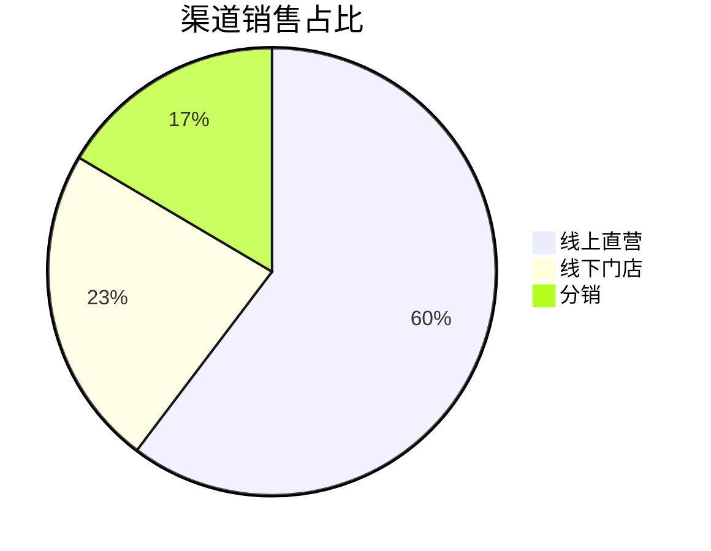
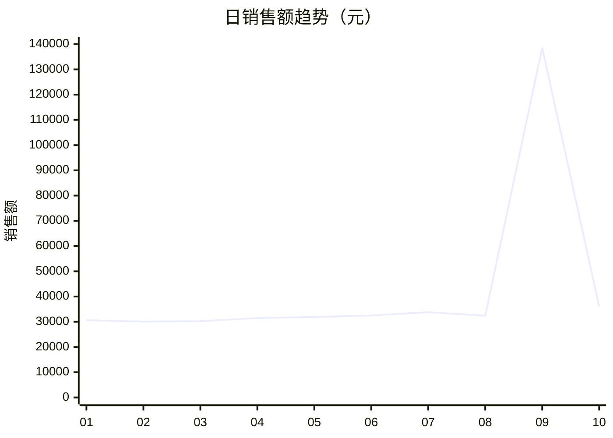

# 电商销售数据洞察报告（示例）

> 数据源：`examples/sample-sales.csv`
> 时间范围：2025-01-01 ~ 2025-01-10　粒度：日
> 生成时间：示例　工具：dsh-data-insight v0.1.0

## 一、核心结论

1. **线上直营是绝对主力渠道**：销售额占比 **60.3%**，日均约 **2.58 万元**，是线下门店（约 0.99 万元）的 **2.6 倍**（见「四、趋势与对比」）。
2. **1 月 9 日出现销售尖峰**：当日销售额 **138,600 元**（其中线上直营华北单笔 120,000 元），为日均（42,767 元）的 **3.2 倍**，属显著异常值（Z-score > 3），需核实是否为大促/错单（见「五、TopN 与异常」）。
3. **数据存在少量质量问题**：`orders` 列缺失 3 行（缺失率 9.7%），并存在 1 条重复行（01-03 分销华南），已按「保留首条」去重处置（见「二、数据概况」）。
4. **剔除异常后整体趋势平稳上行**：1 月 5 日后销售额由 31,890 元温和爬升至 36,100 元（见「四」）。

## 二、数据概况

- 行数 31（含 1 条重复）→ 去重后 **30**；列数 **5**；编码 UTF-8；分隔符逗号。
- 缺失值：`orders` 缺失 3 行（9.7%，去重后 2 行），`revenue` 无缺失。
- 质量处置：1 条重复行按「保留首条」去重；`orders` 缺失行在订单类聚合中排除，并如实记录。

## 三、关键指标

| 指标 | 值 | 口径 |
|---|---:|---|
| 总销售额 | 427,671.25 元 | 去重后 30 行 revenue 求和 |
| 总订单 | 2,636 单 | 去重后 orders 求和（排除 2 个缺失） |
| 日均销售额 | 42,767.13 元 | 总销售额 / 10 天 |
| 客单价 | 162.24 元 | 总销售额 / 总订单 |
| 环比（第 10 日 vs 第 9 日） | -73.9% | 受 1/9 异常尖峰回落影响 |

## 四、趋势与对比

### 渠道销售额占比
| 渠道 | 销售额（元） | 占比 |
|---:|---:|---:|
| 线上直营 | 257,801.25 | 60.3% |
| 线下门店 | 99,400.00 | 23.2% |
| 分销 | 70,470.00 | 16.5% |



### 渠道日均销售额对比（ASCII）
```
线上直营  ████████████████████ 25780
线下门店  ████████              9940
分销      █████                 7047
```

### 日销售额趋势（Mermaid，需 Mermaid 渲染器）


## 五、TopN 与异常

### Top 5 销售额日
| 日期 | 销售额（元） |
|---|---:|
| 2025-01-09 | 138,600.00 |
| 2025-01-10 | 36,100.00 |
| 2025-01-07 | 33,800.00 |
| 2025-01-06 | 32,480.00 |
| 2025-01-08 | 32,400.00 |

### 异常值
| 值 | 所属 | 判定 |
|---|---:|---|
| 120,000.00（revenue） | 2025-01-09 线上直营华北 | Z-score > 3，需核实大促/错单 |
| 900（orders） | 2025-01-09 线上直营华北 | Z-score > 3，同上 |

## 六、风险与建议

- 【事实】线上直营贡献 60.3% 销售额，渠道集中度偏高。
- 【事实】1/9 出现 138,600 元销售额尖峰，显著偏离日均值。
- 【推断】尖峰可能为大促活动或数据录入错误，需业务侧核实（置信度：中）。
- 【建议】① 核实 1/9 订单真实性，避免结论被异常值带偏；② 分销占比仅 16.5%，若为增长目标，建议补充渠道运营动作；③ 修复 `orders` 缺失，保证口径一致。

## 附录 A：口径与可复现说明

- 数据源：`examples/sample-sales.csv`（UTF-8，逗号分隔）。
- 过滤：无；重复行去重（保留首条）。
- 缺失处置：`orders` 缺失行在订单类聚合中排除；`revenue` 无缺失。
- 算法与参数：占比 = 渠道销售额 / 总销售额；环比 = (本期−上期)/上期；异常阈值 Z-score |z|>3；TopN = 5。
- 客单价 = 总销售额 / 总订单；日均销售额 = 总销售额 / 天数。

## 附录 B：探查记录（节选，见 `node scripts/csv-profile.mjs examples/sample-sales.csv`）

| 列名 | 类型 | 缺失 | 摘要 |
|---|---|---|---|
| date | date | 0 | 2025-01-01 ~ 2025-01-10，唯一值 10 |
| channel | text | 0 | 唯一值 3：分销/线上直营/线下门店 |
| region | text | 0 | 唯一值 3：华东/华南/华北 |
| orders | number | 3 | min=30 max=900 mean≈94.1（含异常） |
| revenue | number | 0 | min=6,120 max=120,000 mean≈14,018 |
